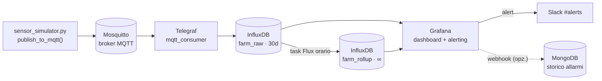
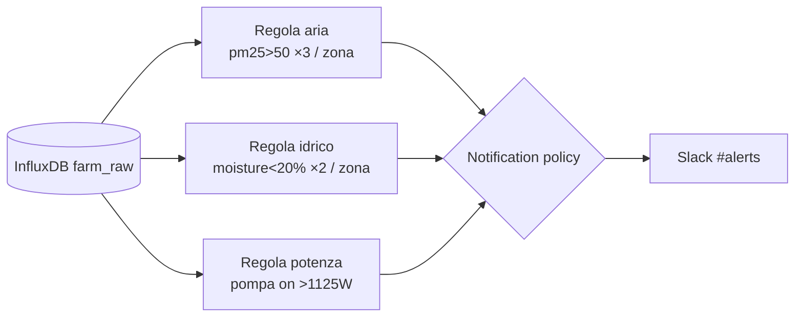

# Smart Farm — Documento di progetto della pipeline

**Corso:** Advanced Data Management — Hackathon "Smart Farm Monitoring & Alerting"
**Scenario:** AgriData, azienda agricola su 3 zone (A/B/C) + 7 attuatori; monitoraggio ambientale, del suolo e dei consumi elettrici, con storage, dashboard e alerting.

> Nota di lettura: i diagrammi sono in **Mermaid** (si renderizzano su GitHub, VS Code con estensione Markdown Preview Mermaid, Obsidian, Typora). Le gerarchie sono in ASCII e si vedono ovunque.

---

## Indice

1. [Requisiti coperti](#1-requisiti-coperti)
2. [Architettura end-to-end](#2-architettura-end-to-end)
3. [Scelte tecnologiche e motivazioni](#3-scelte-tecnologiche-e-motivazioni)
4. [Gerarchia dei topic MQTT](#4-gerarchia-dei-topic-mqtt)
5. [Modello dati InfluxDB](#5-modello-dati-influxdb)
6. [Ingestion: simulatore → MQTT → Telegraf](#6-ingestion-simulatore--mqtt--telegraf)
7. [Storage e aggregazione storica](#7-storage-e-aggregazione-storica)
8. [Visualizzazione (Grafana)](#8-visualizzazione-grafana)
9. [Alerting (Grafana → Slack)](#9-alerting-grafana--slack)
10. [Modulo opzionale: storico allarmi in MongoDB](#10-modulo-opzionale-storico-allarmi-in-mongodb)
11. [Deployment e runbook](#11-deployment-e-runbook)
12. [Divisione del lavoro (4 persone)](#12-divisione-del-lavoro-4-persone)
13. [Problemi aperti ed evoluzioni](#13-problemi-aperti-ed-evoluzioni)

---

## 1. Requisiti coperti

| Requisito | Copertura |
|---|---|
| **FR1 — Injection & Ingestion** | `publish_to_mqtt()` nel simulatore → **Mosquitto**; **Telegraf** consuma `farm/#` |
| **FR2 — Storage** | **InfluxDB**: 4 measurement in `farm_raw` (30d) + `farm_rollup` (∞) per lo storico |
| **FR3 — Visualizzazione** | **Grafana**: soil_moisture, PM2.5, consumi/stato attuatori, vista per zona, trend storico |
| **FR4 — Alerting (≥3)** | **Grafana Unified Alerting**, 3 regole (una istanza per zona) → **Slack** |
| **FR5 — Relazione** | questo documento + schema architetturale |

**Le 3 condizioni di allarme** (anomalie già presenti nei dati campione → gli alert scattano davvero):

| Alert | Condizione | Riscontro nel campione |
|---|---|---|
| Qualità aria | `pm25_ugm3 > 50` per ≥3 letture nella stessa zona | max osservato **300 µg/m³**, 491 letture > 50 |
| Stress idrico | `soil_moisture_pct < 20%` per ≥2 letture nella zona | min osservato **13,4%**, 151 letture < 20 |
| Sovraccarico | attuatore `on` con `power_w > 1.5×` nominale | 610 letture di sovraccarico, picco **2,4×** su `irrigation_pump_2` |

---

## 2. Architettura end-to-end



| Componente | Ruolo | Perché |
|---|---|---|
| Mosquitto | broker MQTT | protocollo nativo IoT, leggero; ~16 msg/s → Kafka sarebbe sovradimensionato |
| Telegraf | ponte MQTT → InfluxDB | ingestion per sola configurazione, zero codice |
| InfluxDB | serie temporali (raw + rollup) | TSDB: compressione, retention e downsampling nativi |
| Grafana | dashboard + alerting | standard di settore per viz **e** alert; motore always-on |
| Slack | notifica allarmi | contact point di Grafana (Incoming Webhook) |
| MongoDB (opz.) | storico allarmi documentale | eventi a schema variabile → document store |

---

## 3. Scelte tecnologiche e motivazioni

**MQTT (Mosquitto), non Kafka.** Il volume è minimo (3 zone × 3 letture + 7 attuatori = 16 msg per ciclo). MQTT è il protocollo pub/sub nativo per telemetria IoT, leggero, e `publish_to_mqtt()` sono ~10 righe con `paho-mqtt`. Kafka (partizioni, offset, replay) risolverebbe problemi che qui non esistono → citato come evoluzione a scala.

**InfluxDB per le serie temporali, anche per il lungo termine.** "Lungo termine" è una proprietà di *retention*, non una natura di dato diversa: un dato temporale resta temporale, quindi va nel TSDB. La distinzione grezzo/aggregato la fanno due bucket con retention diverse, non due tecnologie.

**Grafana per l'alerting (non InfluxDB-native).** È la pratica di settore: Grafana è una piattaforma di observability (dashboard **e** alert), il suo motore di alerting è backend e always-on. Amazon Managed Grafana lo offre come servizio gestito, InfluxDB 3.x ha invece rimosso i check nativi. Vantaggio pratico: una regola con `group by zone` genera un allarme per zona, senza codice.

**Retention a livelli (tiering).** `farm_raw` breve (dati grezzi voluminosi, servono solo di recente); `farm_rollup` infinita (aggregati minuscoli, servono per anni). È la separazione "flussi ad alta frequenza vs. storico" richiesta dalla traccia.

**QoS 1 (at least once).** I dati alimentano gli alert: non vogliamo perdere la lettura che fa scattare l'allarme (QoS 0). I duplicati di QoS 1 sono innocui perché InfluxDB è idempotente su `(measurement, tag, timestamp)`. QoS 2 (exactly once) è overhead inutile.

---

## 4. Gerarchia dei topic MQTT

Schema: **`farm/<gruppo>/<id>/<type>`** — profondità fissa 4 livelli.

```
farm
├── zone/A/air_quality
├── zone/A/soil_quality
├── zone/A/soil_moisture
├── zone/B/air_quality
├── zone/B/soil_quality
├── zone/B/soil_moisture
├── zone/C/air_quality
├── zone/C/soil_quality
├── zone/C/soil_moisture
├── actuator/irrigation_pump_1/power_consumption
├── actuator/irrigation_pump_2/power_consumption
├── actuator/irrigation_pump_3/power_consumption
├── actuator/greenhouse_fan_1/power_consumption
├── actuator/greenhouse_heater_1/power_consumption
├── actuator/led_grow_light_1/power_consumption
└── actuator/gateway_controller/power_consumption
```

Sottoscrizioni con wildcard (`+` = un livello, `#` = tutti):

| Chi | Topic | Riceve |
|---|---|---|
| Telegraf (ingest) | `farm/#` | tutto |
| air_quality | `farm/zone/+/air_quality` | aria di A/B/C |
| soil_moisture | `farm/zone/+/soil_moisture` | umidità di A/B/C |
| power | `farm/actuator/+/power_consumption` | tutti i consumi |
| debug zona A | `farm/zone/A/#` | tutto della zona A |

**QoS:** 1 su tutti i topic (publisher e subscriber). Il gateway (`zone=None`) è semplicemente un `actuator/<id>`, senza casi speciali.

---

## 5. Modello dati InfluxDB

Regole: **bucket = retention**, **measurement = schema omogeneo (= tipo di sensore)**, **tag = dimensione indicizzata a bassa cardinalità**, **field = valori misurati**.

```
Organization: agridata
│
├── Bucket: farm_raw            (retention 30d — real-time)
│   ├── measurement: air_quality
│   │   ├── tags:   zone
│   │   └── fields: temperature_c, humidity_pct, co2_ppm, pm25_ugm3, pm10_ugm3
│   ├── measurement: soil_quality
│   │   ├── tags:   zone
│   │   └── fields: ph, ec_dsm, nitrogen_mgkg, phosphorus_mgkg, potassium_mgkg, soil_temperature_c
│   ├── measurement: soil_moisture
│   │   ├── tags:   zone
│   │   └── fields: soil_moisture_pct
│   └── measurement: power_consumption
│       ├── tags:   actuator_id, actuator_type, zone, status
│       └── fields: power_w, voltage_v, current_a
│
└── Bucket: farm_rollup         (retention ∞ — storico aggregato)
    └── measurement: air_quality   (stessi nomi; è il bucket a dire "aggregato")
        ├── tags:   zone
        └── fields: temperature_c, humidity_pct   (medie orarie)
```

**Motivazioni:** 4 tipi = 4 schemi diversi → 4 measurement (non una measurement unica con tag `type`). `sensor_id` NON è un tag (ridondante: deriva da measurement + zone). `status` è tag perché lo si filtra nell'alert potenza. Il gateway senza zona: si omette il tag `zone`. Cardinalità totale = poche decine di serie → nessun rischio di *cardinality explosion*.

**Retention consigliate:**

| Bucket | Retention | Perché |
|---|---|---|
| `farm_raw` | **30d** | finestra di dettaglio recente; > della finestra del rollup |
| `farm_rollup` | **∞ (`0`)** | storico per mesi/anni (esigenza #2); costa pochi MB/anno |
| MongoDB `alerts` (opz.) | 1 anno / ∞ | eventi rari e piccoli |

---

## 6. Ingestion: simulatore → MQTT → Telegraf

### 6.1 `publish_to_mqtt()` (nel simulatore)

Sostituire la funzione vuota e aggiungere in testa:

```python
import os
import paho.mqtt.client as mqtt

_mqtt = mqtt.Client()
_mqtt.connect_async(os.getenv("MQTT_HOST", "mosquitto"), 1883, keepalive=60)
_mqtt.loop_start()

def _topic_for(p: dict) -> str:
    if p["type"] == "power_consumption":
        return f"farm/actuator/{p['actuator_id']}/power_consumption"
    return f"farm/zone/{p['zone']}/{p['type']}"

def publish_to_mqtt(payload: dict) -> None:
    _mqtt.publish(_topic_for(payload), json.dumps(payload), qos=1)
```

Aggiungere `paho-mqtt>=1.6,<2.0` a `requirements.txt` e riattivare `COPY requirements.txt` + `RUN pip install` nel `Dockerfile`.

### 6.2 `telegraf/telegraf.conf`

Un input per tipo (→ measurement pulite), un solo output.

```toml
[agent]
  flush_interval = "1s"
  omit_hostname  = true

# --- air_quality ---
[[inputs.mqtt_consumer]]
  servers = ["tcp://mosquitto:1883"]
  topics  = ["farm/zone/+/air_quality"]
  qos     = 1
  data_format   = "json"
  name_override = "air_quality"
  tag_keys = ["zone"]
  json_time_key    = "timestamp"
  json_time_format = "2006-01-02T15:04:05.999Z07:00"

# --- soil_quality ---
[[inputs.mqtt_consumer]]
  servers = ["tcp://mosquitto:1883"]
  topics  = ["farm/zone/+/soil_quality"]
  qos     = 1
  data_format   = "json"
  name_override = "soil_quality"
  tag_keys = ["zone"]
  json_time_key    = "timestamp"
  json_time_format = "2006-01-02T15:04:05.999Z07:00"

# --- soil_moisture ---
[[inputs.mqtt_consumer]]
  servers = ["tcp://mosquitto:1883"]
  topics  = ["farm/zone/+/soil_moisture"]
  qos     = 1
  data_format   = "json"
  name_override = "soil_moisture"
  tag_keys = ["zone"]
  json_time_key    = "timestamp"
  json_time_format = "2006-01-02T15:04:05.999Z07:00"

# --- power_consumption ---
[[inputs.mqtt_consumer]]
  servers = ["tcp://mosquitto:1883"]
  topics  = ["farm/actuator/+/power_consumption"]
  qos     = 1
  data_format   = "json"
  name_override = "power_consumption"
  tag_keys = ["actuator_id", "actuator_type", "zone", "status"]
  json_time_key    = "timestamp"
  json_time_format = "2006-01-02T15:04:05.999Z07:00"

# --- output ---
[[outputs.influxdb_v2]]
  urls         = ["http://influxdb:8086"]
  token        = "${INFLUX_TOKEN}"
  organization = "agridata"
  bucket       = "farm_raw"
```

---

## 7. Storage e aggregazione storica

I due bucket sono due **livelli di retention** dello stesso TSDB. Gli aggregati sono **materializzati** (salvati fisicamente in `farm_rollup`), non ricalcolati ad ogni query: così sopravvivono alla scadenza dei grezzi (dopo 30 giorni `farm_raw` è vuoto ma lo storico orario resta).

### 7.1 Bucket storico + task di rollup

`influx/rollup.flux`:

```flux
option task = {name: "rollup_orario", every: 1h}

from(bucket: "farm_raw")
  |> range(start: -1h)
  |> filter(fn: (r) => r._measurement == "air_quality")
  |> filter(fn: (r) => r._field == "temperature_c" or r._field == "humidity_pct")
  |> aggregateWindow(every: 1h, fn: mean, createEmpty: false)
  |> to(bucket: "farm_rollup")
```

Creazione (una tantum, dopo l'avvio):

```bash
docker compose exec influxdb influx bucket create \
  --org agridata --token dev-token-change-me --name farm_rollup --retention 0

docker compose exec influxdb influx task create \
  --org agridata --token dev-token-change-me --file /work/rollup.flux
```

**Finestra = 1h** (la traccia chiede "valori orari medi"; cattura il ciclo giornaliero; ~8.760 punti/anno per serie). In demo abbassare `every`/`range` a `1m` per vedere subito i punti. Miglioramento opzionale: salvare anche `min`/`max` oltre alla media (utile per la manutenzione preventiva).

---

## 8. Visualizzazione (Grafana)

Datasource `grafana/provisioning/datasources/influxdb.yaml`:

```yaml
apiVersion: 1
datasources:
  - name: InfluxDB
    type: influxdb
    access: proxy
    url: http://influxdb:8086
    jsonData:
      version: Flux
      organization: agridata
      defaultBucket: farm_raw
    secureJsonData:
      token: dev-token-change-me
```

Pannelli della dashboard:

1. Umidità del suolo per zona (con soglia a 20%).
2. PM2.5 per zona (con soglia a 50).
3. Consumi attuatori (`power_w`) + stato on/off (state timeline).
4. Vista riassuntiva per zona (ultimi valori medi temp/umidità).
5. Trend storico da `farm_rollup` (medie orarie su giorni/settimane).
6. Lista allarmi (dallo stato di Grafana, o da MongoDB se attivo).

---

## 9. Alerting (Grafana → Slack)



Le regole valutano ogni ~10s una query Flux su `farm_raw` (motore backend, indipendente dalle dashboard aperte). Pattern: "conta le letture oltre soglia nella finestra recente" → cattura le letture consecutive; `group by zone` → un allarme per zona.

**Alert 1 — aria** (condizione: `count IS ABOVE 2`):
```flux
from(bucket: "farm_raw") |> range(start: -10s)
  |> filter(fn: (r) => r._measurement == "air_quality" and r._field == "pm25_ugm3")
  |> filter(fn: (r) => r._value > 50.0)
  |> group(columns: ["zone"]) |> count()
```

**Alert 2 — stress idrico** (condizione: `count IS ABOVE 1`):
```flux
from(bucket: "farm_raw") |> range(start: -10s)
  |> filter(fn: (r) => r._measurement == "soil_moisture" and r._field == "soil_moisture_pct")
  |> filter(fn: (r) => r._value < 20.0)
  |> group(columns: ["zone"]) |> count()
```

**Alert 3 — sovraccarico pompe** (condizione: `count IS ABOVE 0`):
```flux
from(bucket: "farm_raw") |> range(start: -10s)
  |> filter(fn: (r) => r._measurement == "power_consumption" and r._field == "power_w")
  |> filter(fn: (r) => r.status == "on" and r.actuator_type == "pump")
  |> filter(fn: (r) => r._value > 1125.0)
  |> group(columns: ["actuator_id"]) |> count()
```

Contact point Slack — `grafana/provisioning/alerting/contactpoints.yaml`:

```yaml
apiVersion: 1
contactPoints:
  - orgId: 1
    name: slack-farm
    receivers:
      - uid: slack_farm_1
        type: slack
        settings:
          url: ${SLACK_WEBHOOK_URL}
          title: '🚨 {{ .CommonLabels.alertname }} — zona {{ .CommonLabels.zone }}'
          text: '{{ range .Alerts }}{{ .Annotations.summary }} (valore: {{ .ValueString }})\n{{ end }}'
policies:
  - orgId: 1
    receiver: slack-farm
    group_by: ['alertname', 'zone']
```

Lato Slack: crea un'app "from scratch" → Incoming Webhooks → copia l'URL in `.env` (`SLACK_WEBHOOK_URL=...`).

---

## 10. Modulo opzionale: storico allarmi in MongoDB

Secondo contact point di tipo `webhook` verso un micro-servizio che scrive gli eventi in Mongo. `alert-webhook/app.py`:

```python
from fastapi import FastAPI, Request
from pymongo import MongoClient

app = FastAPI()
col = MongoClient("mongodb://mongo:27017/").farm.alerts

@app.post("/alert")
async def alert(req: Request):
    body = await req.json()
    for a in body.get("alerts", []):
        col.insert_one({
            "status": a.get("status"),
            "labels": a.get("labels"),
            "value":  a.get("valueString"),
            "startsAt": a.get("startsAt"),
        })
    return {"ok": True}
```

Slack riceve la notifica, MongoDB conserva lo storico interrogabile (multi-modello: TSDB + document store).

---

## 11. Deployment e runbook

### 11.1 Struttura del progetto

```
hackathon-smartfarm/
├── docker-compose.yml
├── Dockerfile                 (fornito, + paho-mqtt)
├── requirements.txt           (fornito, + paho-mqtt)
├── sensor_simulator.py        (fornito, + publish_to_mqtt)
├── .env                       (SLACK_WEBHOOK_URL=...)
├── mosquitto/mosquitto.conf
├── telegraf/telegraf.conf
├── influx/rollup.flux
├── grafana/provisioning/{datasources,alerting}/
└── alert-webhook/             (opzionale) app.py + Dockerfile
```

### 11.2 `docker-compose.yml`

```yaml
services:
  sensor-simulator:
    build: .
    container_name: farm-sensor-simulator
    command: ["--interval", "1", "--csv-path", "data/sensor_data.csv"]
    environment: { MQTT_HOST: mosquitto }
    depends_on: [mosquitto]
    volumes: ["./data:/app/data"]

  mosquitto:
    image: eclipse-mosquitto:2
    ports: ["1883:1883"]
    volumes: ["./mosquitto/mosquitto.conf:/mosquitto/config/mosquitto.conf:ro"]

  influxdb:
    image: influxdb:2.7
    ports: ["8086:8086"]
    environment:
      DOCKER_INFLUXDB_INIT_MODE: setup
      DOCKER_INFLUXDB_INIT_USERNAME: admin
      DOCKER_INFLUXDB_INIT_PASSWORD: hackathon123
      DOCKER_INFLUXDB_INIT_ORG: agridata
      DOCKER_INFLUXDB_INIT_BUCKET: farm_raw
      DOCKER_INFLUXDB_INIT_RETENTION: 30d
      DOCKER_INFLUXDB_INIT_ADMIN_TOKEN: dev-token-change-me
    volumes:
      - influxdb-data:/var/lib/influxdb2
      - ./influx:/work:ro

  telegraf:
    image: telegraf:1.30
    depends_on: [mosquitto, influxdb]
    environment: { INFLUX_TOKEN: dev-token-change-me }
    volumes: ["./telegraf/telegraf.conf:/etc/telegraf/telegraf.conf:ro"]

  grafana:
    image: grafana/grafana:11.1.0
    ports: ["3000:3000"]
    depends_on: [influxdb]
    environment:
      GF_SECURITY_ADMIN_PASSWORD: admin
      SLACK_WEBHOOK_URL: ${SLACK_WEBHOOK_URL}
    volumes:
      - ./grafana/provisioning:/etc/grafana/provisioning:ro
      - grafana-data:/var/lib/grafana

  # ---- opzionale ----
  mongo:
    image: mongo:7
    ports: ["27017:27017"]
    volumes: ["mongo-data:/data/db"]
  alert-webhook:
    build: ./alert-webhook
    depends_on: [mongo]

volumes: { influxdb-data: {}, grafana-data: {}, mongo-data: {} }
```

`mosquitto/mosquitto.conf`:
```
listener 1883
allow_anonymous true
```

### 11.3 Avvio e verifica

```bash
docker compose up --build              # avvia tutto
# 1) messaggi su MQTT:
docker run --rm --network hackathon-smartfarm_default eclipse-mosquitto \
  mosquitto_sub -h mosquitto -t 'farm/#' -v
# 2) dati in InfluxDB:
docker compose exec influxdb influx query --org agridata --token dev-token-change-me \
  'from(bucket:"farm_raw") |> range(start:-1m)'
# 3) crea bucket rollup + task (vedi §7.1)
# 4) Grafana su http://localhost:3000 (admin/admin) → dashboard + alert
# 5) forza le anomalie:  --interval 0.2  → verifica il messaggio su Slack
```

> Attenzione: non lanciare `docker compose` da cartelle sincronizzate col cloud (Google Drive/OneDrive/Dropbox): i bind mount non funzionano.

---

## 12. Divisione del lavoro (4 persone)

Il voto è individuale: ognuno possiede un modulo e sa spiegarlo in dettaglio.

| # | Ruolo & componenti | FR | Deve saper spiegare |
|---|---|---|---|
| **P1** | Ingestion & orchestrazione: `publish_to_mqtt()`, topic, Mosquitto, `docker-compose.yml` | FR1 | pub/sub MQTT, QoS, topic design, MQTT vs Kafka |
| **P2** | Bridge & modello dati: `telegraf.conf`, modello InfluxDB (`farm_raw`, measurement/tag/field) | FR2 | modellazione TSDB, tag vs field, cardinalità, parsing |
| **P3** | Storico & aggregazioni: `farm_rollup`, task Flux, retention; (opz.) MongoDB | FR2 #2 | retention tier, downsampling, materializzato vs query |
| **P4** | Visualizzazione & alerting: dashboard, 3 regole Grafana, Slack | FR3+FR4 | query pannelli, logica dei 3 alert, notification policy |

**Interfacce (da concordare al minuto zero):**
- P1 → P2: schema JSON dei messaggi + convenzione topic.
- P2 → P3/P4: schema di `farm_raw` (measurement/tag/field).
- P3 → P4: bucket `farm_rollup` per i trend.

**Ordine:** P1 (dati su MQTT) → P2 (riempie `farm_raw`) → P3 e P4 in parallelo. Trucco: importare il CSV campione in InfluxDB per far partire P3/P4 subito.

---

## 13. Problemi aperti ed evoluzioni

- **Scala:** oltre certi volumi o con più consumatori → passare a Kafka; archiviazione fredda su storage colonnare (Parquet).
- **Cascata di rollup:** grezzi 30d → medie orarie 1–2 anni → medie giornaliere ∞.
- **Deduplica alert:** un allarme persistente può ri-notificare → `for`/silenze/cooldown.
- **Alert di correlazione** (bonus): "pompa off & umidità bassa" → richiede un `join` tra due measurement.
- **Sicurezza:** fuori scope per la traccia (auth broker, TLS, token), ma da citare.
